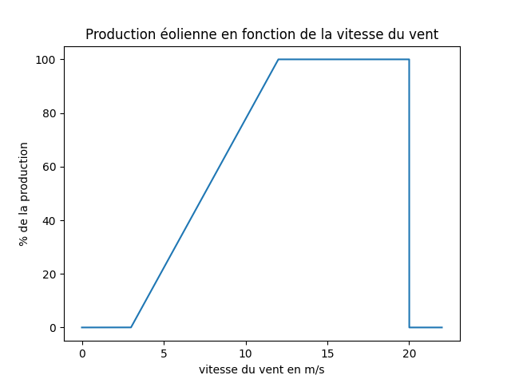
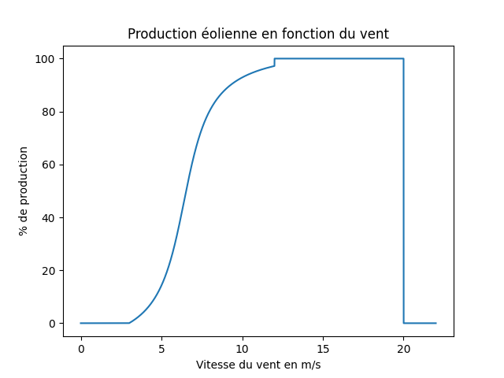

# ENR_Simul_France
Simulation de la production des ENR sur le territoire français métropolitain en direct

## Description du projet

Le but à long terme du projet ENR_Simul_France est de fournir une simulation de la production des ENR sur le territoire français métropolitain en direct et de trouver le meilleur endroit où installer une éolienne, un panneau solaire, un barrage etc... Pour l'instant, le projet est en cours de développement et ne permet que de simuler la production des ENR sur le territoire français métropolitain.

### Prérequis

Pour pouvoir utiliser le projet ENR_Simul_France, il faut avoir installé Python 3.7.3 et les librairies suivantes :

* numpy
* pandas
* matplotlib
* multiprocessing
* zmq
* pyproj
* sqlite3
* requests
* progressbar2
* urllib
* json
* wptools

### Installation

Pour installer le projet ENR_Simul_France, il faut cloner le projet sur votre ordinateur en utilisant la commande suivante :

```git clone https://github.com/Bandamo/ENR_Simul_France ```

ou en téléchargeant le projet en .zip et en le décompressant.

Il faut ensuite installer les librairies nécessaires au projet en utilisant la commande suivante :

```pip install -r requirements.txt ```

## Description des fichiers

### Fichiers de données

Le dossier database contient les fichiers de données utilisés par le projet ENR_Simul_France. Ces fichiers sont :

**eolFIlles.csv**

Fichier brutes contenant le Référentiel Éolien Terrestre National (RETN). Celui-ci est disponible sur le site :

[Se rendre sur data.gouv.fr](https://www.data.gouv.fr/fr/datasets/retn-referentiel-eolien-terrestre-national-carte-des-eoliennes-en-service-au-sein-de-la-france-metropolitaine-hors-corse/)

sous des formats moins communs que le .csv. Il a donc été converti en .csv pour faciliter son utilisation.

**eolienne.db**

Fichier contenant les données de la base de données SQLite3. Il contient toutes les tables de données relatibes aux éoliennes.

On compte parmi elles :

* eolCoord : Table liant le *gid* de l'éolienne à sa position géographique.
* eolDate : Table liant le *gid* de l'éolienne à ses dates de mise en service et démantèlement, notons que les éoliennes dont ces données ne sont pas renseignées s'en voient attribuées aléatoirement selon les lois normales de densité : 
  $$f_{creation}(x) = min(2013 + \dfrac{1}{0.4\sqrt{2\pi}}e^{-\dfrac{1}{2}\left(\dfrac{x}{0.4}\right)^2}, 2023) $$

  $$f_{demantelement}(x) = date\_creation + 22 + \dfrac{1}{\sqrt{2\pi}}e^{-\dfrac{1}{2}x^2} $$

* eolFiltre : Table contenant les données brutes du RETN sous forme de base de données
* eolFiltreGroup : Tables contenant les données brutes du RETN regroupées par parc éolien, on y garde le nom du parc, sa puissance nominale totale et les *gid* des éoliennes qui le composent.
* nonarchive et used sont des tables temporaires permettant l'exécution de code en plusieurs fois

**hydro.csv**

Faute de pouvoir trouver une liste des barrages hydroélectriques français, j'ai utilisé la liste des cours d'eau français. Celle-ci contient dans l'ordre:

* le nom du cours d'eau
* l'embouchure
* le bassin versant
* la longueur

**hydro.db**

La base de donnée SQLite3 contenant les données sur les cours d'eau sous forme de base de données. Elle ne contient qu'une table "**hydro**".
Cette table contient comme données additionnelles la hauteur maximale du cours d'eau, la hauteur minimale ainsi que le débit.

### Fichiers de code

**main.py**

**productionEolienne.py**

Le fichier *productionEolienne.py* contient toutes les fonctions nécéssaires à la simulation de la production des éoliennes. Il contient notamment les fonctions suivantes :

* *Regroup* : fonction permettant de regrouper les éoliennes par parc éolien afin de générer la table EolFiltreGroup vue plus haut.
* *Verif* : fonction permettant de vérifier que les données du RETN sont toutes regroupées.
* *coord* : fonction permettant de retrouver les coordonnées géographiques des différents parcs éoliens, cette fonction commence par vérifier si les coordonnées sont déjà présentes dans la base de données et dans ce cas elle les traduit en format *(Longitude, Latitude)*. 
Si les coordonnées ne sont pas présentes, la fonction tente des les récupérer grâce à l'API de [Here](https://developer.here.com/)
* *duree_de_vie* : fonction permettant de calculer la durée de vie des éoliennes en fonction de leur date de mise en service (voir fonction dentsité plus haut).

Fonction pricipale : *production*

Cette fonction mérite que l'on s'arrête dessus plus longtemps car elle est la fonction principale du projet. Elle permet de calculer la production d'énergie des éoliennes en fonction de leur position géographique, de leur puissance nominale et de leur durée de vie.

La production d'une éolienne se calcule en fonction de la vitesse du vent, ce n'est pas une fonction linéaire du temps.

En théorie, puisque nous n'avons pas de données sur les vitesses de déclenchement et de coupure des éoliennes, nous supposons que les éoliennes se déclenchent à 3 m/s et atteingnent leur puissance nominale à 12 m/s et coupent à 23 m/s.

On a donc linéairement : 

On crée une fonction plus lisse de la forme : 
$$f(x) = \left\{\begin{array}{ll} 0 & \text{si } x<3 \\ 100\% \cdot (\dfrac{1.188}{\pi} \cdot \arctan(0.8\cdot(w-6.4))+0.461) & \text{si } 3\leq x<12 \\ 1 & \text{si } 12\leq x<23 \\ 0 & \text{si } x\geq 23 \end{array}\right. $$

Ainsi, on a :



On peut ainsi récupérer les données de vitesse de vent grâce à l'API de [OpenWeatherMap](https://openweathermap.org/api) et calculer la production d'énergie de chaque éolienne en fonction de sa position géographique et de sa puissance nominale.

**productionPanneauSolaire.py**

Ce fichier a pour objectif de calculer la production d'énergie de panneaux solaires sur toitures, aucune donnée n'est disponible sur la répartition des panneaux solaires sur toitures, j'ai donc créé une fonction calculant ceci en fonction du porcentage de surface supposée en panneau solaire.

Tout se déroule dans la fonction *prod*, celle-ci commence par calculer l'angle du soleil en fonction de l'heure.
On suppose que le soleil se lève à 6h30 et se couche à 21h40, ainsi on peut donner l'angle du soleil en fonction de l'heure grâce à une fonction affine de l'heure de la forme :
$$\phi(t) = \dfrac{t-6h30}{21h40-6h30} $$

À partir de cela on a selon le site [Shodor](http://www.shodor.org/os411/courses/_master/tools/calculators/solarrad/), l'enseoleillement en W/m² :
$$R = R_0(1-0.75\times n^{3.4}) * \sin(\phi(t)) $$
avec $R_0=990-30$ et $n$ la nébulosité donnée par l'API de [OpenWeatherMap](https://openweathermap.org/api).

En supposant les panneaux solaires ayant une efficacité de 40%, on peut donc calculer la puissance fournie.